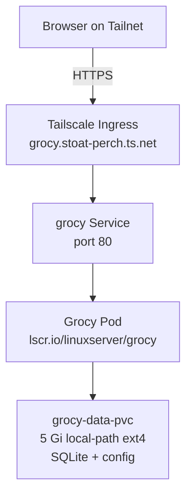

# Grocy — Architecture & Tech Stack

**On this page:** [Deployment diagram](#deployment-diagram) · [What is it](#what-is-it) · [Tech stack](#tech-stack) · [Source code](#source-code) · [Local config files](#local-config-files) · [Data layout](#data-layout) · [Why SQLite, not Postgres?](#why-sqlite-not-postgres) · [Why not a custom app?](#why-not-a-custom-app) · [Voice control integration](#voice-control-integration) · [Reference](#reference)

## Deployment diagram



## What is it

[Grocy](https://grocy.info) is a self-hosted ERP for the kitchen — pantry inventory, expiry dates, recipes, shopping lists, equipment, batteries, chores.

## Tech stack

| Layer | Tech |
|---|---|
| App | Grocy (PHP, by Bernd Bestel) — off-the-shelf, no custom code |
| Container | `lscr.io/linuxserver/grocy:latest` (LinuxServer.io image) |
| Database | SQLite (single file inside `/config/data/grocy.db`) |
| Web server | nginx (built into the LinuxServer image) |
| Storage | PVC on `local-path` (VM ext4) — 5 Gi |
| Ingress | Tailscale (HTTPS) |
| Cluster | k3s in OrbStack |

## Source code

Grocy is **off-the-shelf** — no custom code from us.

| | |
|---|---|
| Upstream code | https://github.com/grocy/grocy |
| LinuxServer Docker image | https://github.com/linuxserver/docker-grocy |
| API docs | https://demo.grocy.info/api/ |

## Local config files

| File | Purpose |
|---|---|
| `~/homelab/grocy-server.yaml` | k8s manifests (PVC, Deployment, Service, Ingress) |
| `docs/configs/grocy-server.yaml` | Snapshot |

## Data layout

```
PVC: grocy-data-pvc (5Gi, local-path)
└── /config/                ← mounted into pod at /config
    ├── data/
    │   ├── grocy.db        ← SQLite database (everything is in here)
    │   └── ...
    ├── plugins/
    ├── viewcache/
    └── log/
```

The DB is a single SQLite file. Backups can be a tar of the whole `/config` dir.

## Why SQLite, not Postgres?

Grocy's upstream supports SQLite (default) and MariaDB/MySQL — **not Postgres**. For a single-user/family homelab, SQLite is simpler, faster, and doesn't need a separate DB pod. Switching to MariaDB would mean running another container for no functional benefit.

Other apps in the homelab (chores, emailmatrix) use the [shared-postgres](../shared-postgres/README.md) — Grocy intentionally doesn't, because its native DB is SQLite.

## Why not a custom app?

The user originally asked for a custom Java inventory app. Grocy was deployed instead because:
- It already does **everything** asked for (qty, multiple expiry per product, "expiring soon" view, consume workflow, mobile UI)
- Plus a lot extra (recipes, shopping list, barcode scan, multi-user)
- 1000s of homelabs use it — battle-tested
- Building equivalent custom would be weeks of work

See [USAGE](USAGE.md) for the daily-use guide and [ADVANCED](ADVANCED.md) for the rest of its features.

## Voice control integration

The Siri Shortcuts approach in [README](README.md#voice-control-siri-shortcuts-on-iphone) uses Grocy's REST API directly from the phone. No additional infrastructure needed in the cluster.

For Alexa/Google Home: would need Home Assistant (another homelab app) + Nabu Casa subscription. Not deployed.

## Reference

- Grocy docs: https://docs.grocy.info
- Demo (try without messing yours up): https://demo.grocy.info
- LinuxServer image readme: https://docs.linuxserver.io/images/docker-grocy
